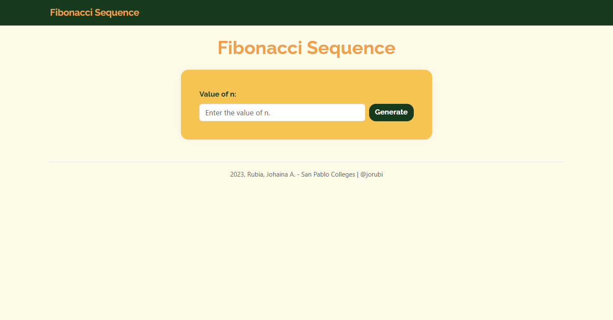
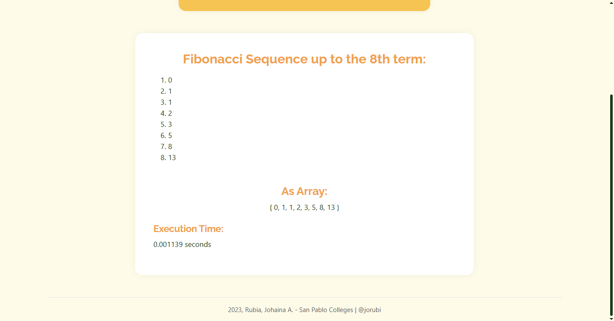

# Fibonacci Sequence

**Fibonacci Sequence** is a simple web application that generates the Fibonacci sequence up to the _nth_ term entered by the user.
The application is built using Flask and styled with Bootstrap to provide a clean and responsive user experience.

>Developed as a course requirement for **CC106 - Applications Development and Emerging Technologies**, by **Johaina A. Rubia**.

---

### See Live in :
[https://fibonacci-sequence.onrender.com](https://fibonacci-sequence.onrender.com)  

---

## Features

- **Fibonacci Generator:**  
  Enter any value of `n` and the application dynamically calculates and displays the sequence up to that term.
- **User-Friendly Design:**  
  Clean, responsive, and modern UI built using Bootstrap 5 and custom CSS styling.
- **Execution Time Display:**  
  Shows how fast the calculation was executed, for a little performance insight.

---

## Previews

### Input View
  
_The homepage where users can enter a number to generate the Fibonacci sequence._

---

### Result View
  
_The application displays the Fibonacci sequence, formatted with ordinal indicators, an array preview, and the execution time._

---

## Technologies Used

- **Flask**
- **HTML/CSS/JavaScript**
- **Bootstrap 5**
- **Jinja2**

